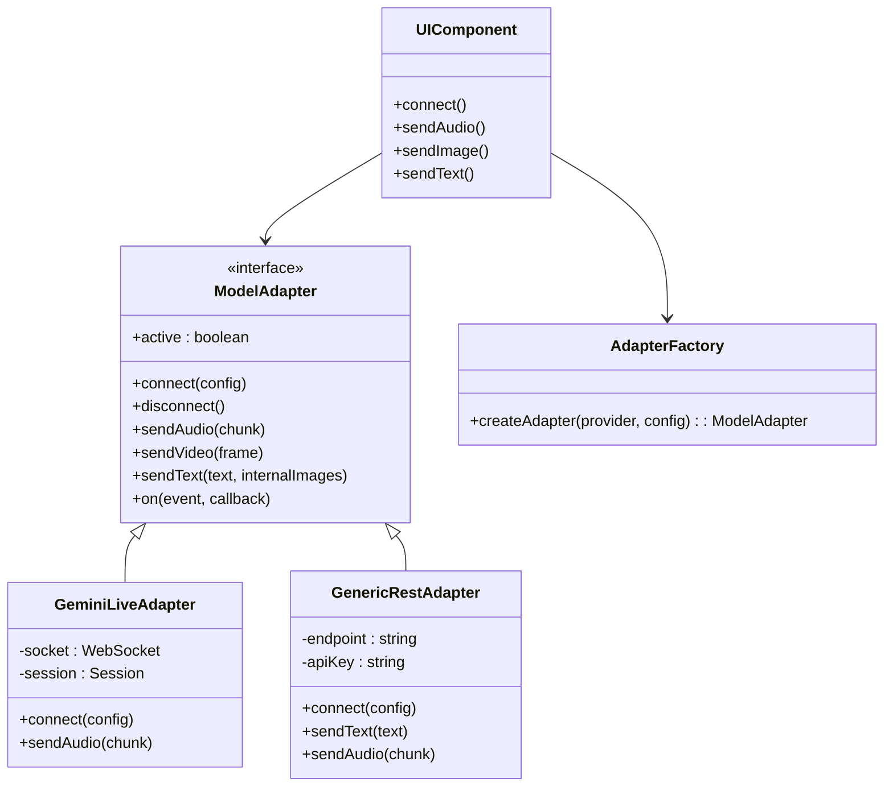

# Model Adapter Layer Design

## 1. Problem Statement
The current application is tightly coupled to the Google Gemini Live API (BidiStreaming over WebSocket). To support additional models (e.g., Gemini Flash via REST, OpenAI Realtime, etc.) and future vendors, we need an abstraction layer that isolates the UI components from specific API protocols.

## 2. Architecture Overview

We will implement a **Model Adapter Pattern**. The UI will interact with a generic `ModelClient` interface, while concrete adapters handle the specific protocol details (WebSocket management, REST polling, data transformation).



## 3. Abstract Interface Specification implementation

The `ModelAdapter` interface (or Base Class) will define the standard contract.

### Methods
- `connect(config: ConnectionConfig): Promise<void>`
    - Establishes connection (WebSocket handshake or auth validation).
- `disconnect(): void`
    - Closes connection and cleans up resources.
- `sendAudio(pcmData: Int16Array | Base64String): void`
    - Sends an audio chunk. Adapter handles buffering/encoding.
- `sendInternalImage(imageData: Base64String): void`
    - Sends a visual frame (for real-time vision).
- `sendText(text: string, contextImages?: Base64String[]): void`
    - Sends a text prompt (multimodal).
- `interrupt(): void`
    - Signals the model to stop generating.
- `updateConfig(config: Partial<ConnectionConfig>): void`
    - Updates settings (voice, instructions) on the fly if supported.

### Events (Output)
- `on('open')`: Connection established.
- `on('error', error)`: Connection or API error.
- `on('close')`: Connection closed.
- `on('content', contentData)`:
    - `contentData` normalized schema:
        ```javascript
        {
          type: 'text' | 'audio' | 'transcript_input' | 'transcript_output' | 'tool_call',
          data: string | object, // text, base64 audio, or tool args
          final: boolean,        // is this the end of the turn?
        }
        ```

## 4. Implementation Strategy

### A. Refactoring Existing Gemini Logic
The current `GeminiLiveAPI` class in `src/utils/gemini-api.js` is already close to being an adapter. We will refactor it to implement the unified interface.

- **Rename:** `GeminiLiveAPI` -> `GeminiLiveAdapter`.
- **Normalize Events:** Instead of custom callbacks (`onReceiveResponse`), use an EventEmmiter pattern or a standardized listener map.

### B. Scalability for "Gemini Flash" (REST/SSE)
If we support a non-streaming model like Gemini Flash (via REST API):
- **Adapter:** `GeminiRestAdapter`.
- **Behavior:** `sendAudio` might accept chunks but only `sendText` triggers the actual request (accumulated context), OR it sends audio to a separate transcription service first.
- **Output:** Simulates streams if needed, or emits a single 'text' event.

### C. Configuration & Factory
A `config.json` or dynamic UI Selector will drive the factory.

```javascript
// Example Config Schema
{
  "provider": "google",
  "protocol": "websocket_live", // or 'rest'
  "modelId": "gemini-2.0-flash-exp",
  "apiKey": "..."
}
```

## 5. Directory Structure Reference
Proposed changes for future implementation (no code changes yet):

```
src/
  api/
    interfaces/
      IModelAdapter.js
    adapters/
      GeminiLiveAdapter.js
      OpenAIRealtimeAdapter.js
      MockAdapter.js
    ModelAdapterFactory.js
```

## 6. Verification Plan
1. **Unit Tests:** Mock the `ModelAdapter` and ensure UI handles events correctly.
2. **Integration Tests:** Test `GeminiLiveAdapter` with the `LiveAPIDemo` component to ensure no regression in current functionality.
3. **Cross-Vendor Test:** Implement a simple `MockAdapter` that echoes text/audio to verify the UI decoupling works before integrating a second real vendor.
